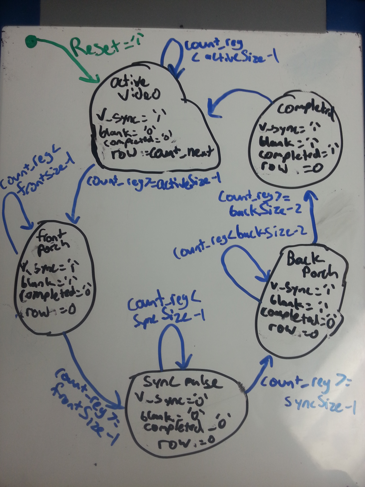

# VGA Synchronization

## Introduction

The purpose of this lab is to create code that will synchronize two signals on a FPGA in order to create a VGA controller. The two signals that are needed are h_sync and v_sync. The h signal is for the horizontal pixels and the v signal is for the vertical lines on the screen. The main problem that needed to be acomplished for this lab was creating these two signals and making sure their timing matched, because if they didn't then the program would not work.

## Implementation

This program was implemented by creating a base h_sync_gen and v_sync_gen. From there I instantiated both of these as components with in a VGA_sync file, which was instantiated in the top level. The overall schematic is shown below.


I implemented the h_sync_gen by the use of a Moore State Machine. This FSM has 5 states: active_video, front_porch, sync_pulse, back_porch, and completed. Each state changes based on a count of how many clock cycles have gone by. Also each of the states have a different output, and a look-ahead output buffer is used to prevent glitches. The following components where used to create the h_sync_gen: state register, count state register, count next logic, next state logic, next output logic, output buffer, and output logic.
I will specifically address the registers and the next logic.

- Registers
 - The registers are simply just Flip Flops, where the state can become stable.
 - State Register example
 ```
 process(reset, clk)
 begin
 	if (reset = '1') then
		state_reg <= active_video;
	elsif rising_edge(clk) then
		state_reg <= state_next;
	end if;
 end process;
 ```
 - Since there is no impact of the reset for the output buffer it is only sensitive to the rising edge of the clock
 ```
 process(clk)
 begin
 	if rising_edge(clk) then
		h_sync_reg <= h_sync_next;
		blank_reg <= blank_next;
		completed_reg <= completed_next;
		column_reg <= column_next;
	end if;
 end process;
 ```
- Next logic
 - Next state and output logic uses sequential statements while next count uses combintational statements. The sequential statements used for output and state are if's and case's. Here is an example of the next output logic
```
process (sate_next, count_next)
begin
	h_sync_next <= '1';
	blank_next <= '1';
	completed_next <= '0';
	column_next <= (others => '0');

	case state_next is
		when active_video =>
			blank_next <= '0';
			column_next <= count_next;
		when front_porch =>
		when sync_pulse =>
			h_sync_next <= '0';
		when back_porch =>
		when complete =>
			completed_next <= '1';
	end case;
end process
```

 - The combinational logic used for count next is: 
```
count_next <= count_reg + 1 when state_reg = state_next else
		(others => '0');
```

The picture below is how the state diagram is implemented:


v_sync_gen is extremely similar to the h_sync_gen, but there are a few differences. The v_sync_gen counts when h_completed is high and the amount of time in each state are the two differences. The time differences are shown in the following state diagram:



The main changes within the code are the next count logic and adding an if statement in the next state logic, checking to see if `h_completed = '1'`. The new next count logic is:

```
count_next <= (others => '0') when state_reg /= state_next else
		count_reg + 1 when h_completed = '1' else
		count_reg;
```

This changed causes the count to increment only when h_completed is high.

The last major item implemented was the pixel generator and the switches to control the test patterns. The test pattern is created by changing the red, blue, and green value when blank was '0'. When it is a '1' all of these values are 0's. The test pattern was created by setting the bottom 350 rows as red, top left third as green, middle third as green, and right third as yellow. Yellow was created by setting both red and green as all 1's. The addition of the switches made the test pattern change colors depending on which switches were high or low.


## Test/Debug

The testing method I used was the using assert statements and checking the waveform of the signal output. The assert statements were useful in the begining, but as more time and tests went on the waveform was more useful. Another technique used was to change the row/column output to constantly show the count in order to see what changes where happening when. The waveforms were essential because yoou can count the amount of time paasses in each state, which affirms the timing of each signal.  

I ran into a couple of main issues. The first being an additional count in my v_sync_gen and the second being I was running into some glitches due to a quick state change. The third issue was using the correct clock. 

- The first issue was fixed by adding an if statement checking to see if `h_completed = '1'`. This caused the last value of the count to "stall" instead of switching after the next clock cycle. It made the next state logic dependent on h_completed. 

- The second issue was fixed by the use of a look-ahead output buffer. The output buffer caused all switching of states and outputs to settle before they showed change. This is essential for making sure your signals are stable and happen when expected.

- The third issue was fixed by changing clk to pixel_clk in my top level. This change changed the clock speed from 100MHz to 25MHz which makes a big deal when dealing with sending signals through an output.

## Conclusion

Overall I learned that timing is an absolutly crutial part in desiging digital systems. I learned that even one clock cycle difference can give you a big problem. I also learned that out buffers are key in the use of moore machines because you decrease your risk of a glitch exponentially. If I were to change this lab I would add another lab prior in order to demonstrate basic VHDL skills without such of an emphasis on timing. The extreme timing requirement made this lab a lot tougher.
